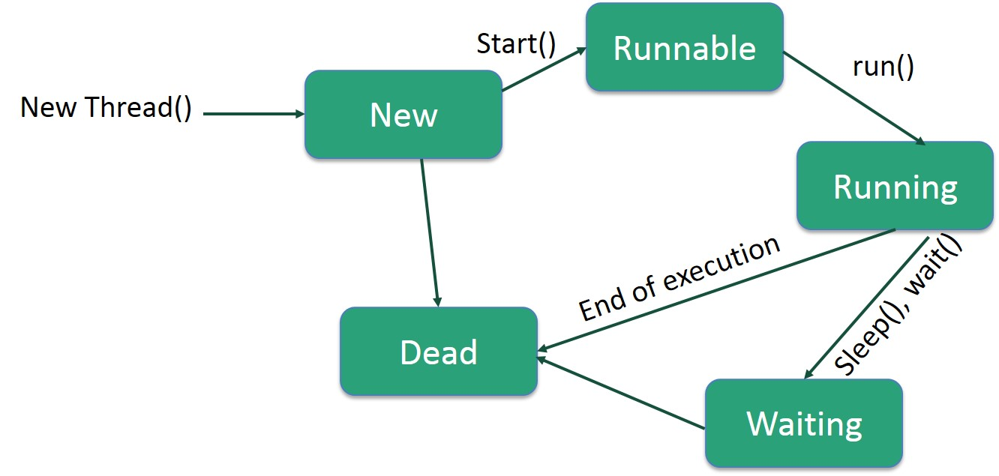

## Concurrencia
[Go to Index](resumen.md)

## Programa vs Proceso

**Programa** --> Secuencia de instrucciones que residen en almacenamiento no volatil, esperando ser corridas.

**Proceso** --> Programa en ejecución, que tiene ciertos recursos asignados, se carga en memoria volátil para ser ejecutado.

## Programacion Secuencial

Hay varios modelos para poder ejecutar programas de manera secuencial, por *orden de llegada*, por *tiempo estimado de ejecución* o *intercalado con un scheduler*.

## Programacion Concurrente

Aprovecha a los *threads* y los *procesadores multicore*. El algoritmo identifica zonas de código que pueden correr de forma concurrente, se definen esas zonas de manera que pueda correr de manera concurrente y si se tienen procesadores multicore, se pueden correr paralelamente los threads.

**Concurrente != Paralelo**, *concurrente* es si la aplicación pueden tener 2 o más tareas en progreso al mismo tiempo (puede ser 1 core y que estén intercaladas), mientras que *paralelo* es que el sistema puede tener 2 o más tareas corriendo al mismo tiempo (multicore con 2 threads). 

### Threads vs Procesos

Un proceso puede tener múltiples threads corriendo, que son subunidades de ejecución.

Los *Threads* comparten memoria y recursos, y pueden comunicarse entre los diferentes threads, mientas que los *Procesos* tienen que usar IPC.

Es mucho más fácil crear y hacer context switches en un *thread*, y requiere menos recursos.

El control del *thread* es responsabilidad del programador, mientras que para los *procesos* se ocupa el OS.

## Threads en Java

### Como implementar un Thread

Hay varias formas de usar los Threads en Java:
1. Se puede implementar una clase que extienda de `Thread`
    ```java
    public class HelloThread extends Thread {
        // Implementar el método run
        public void run() {
            System.out.println("Hello from a thread!");
        }
        public static void main(String args[]) {
            Thread thread = new HelloThread();
            thread.start(); // Llamar al método start
        }
    }
    ```
2. Se puede implementar la interfaz `Runnable`
    ```java
    public class HelloRunnable implements Runnable {
        // Implementar el método run
        public void run() {
            System.out.println("Hello from a thread!");
        }
        public static void main(String args[]) {
            Thread helloThread = new Thread(new HelloRunnable());
            helloThread.start(); // Llamar al método start
        }
    }
    ```

La segunda opción es mejor, ya que como Java no tiene multiherencia, no te limita tanto la implementación.

### Metodos de Threads

La clase `Thread` tiene métodos estáticos de utilidad:
- `Thread currentThread()` --> Devuelve instancia del thread actual
- `void sleep(long millis)` --> Suspende al thread actual
- `boolean interrupted()` --> Indica si el thread actual fue interrumpido
- `void yield()` --> Indica que el thread actual puede liberar el procesador por el momento
- `boolean holdsLock(Object obj)` --> Informa si el thread actual tiene un lock sobre el objeto dado.

También tiene métodos de instancia de utilidad:
- `String getName()` --> Devuelve el nombre del thread
- `void interrupt()` --> Interrumpe al Thread. Si el mismo está suspendido en un wait o join, el mismo recibe una InterruptedException
- `boolean isAlive()` --> Indica si el Thread está vivo, osea, iniciado pero no terminado
- `void join()` --> Suspende la ejecución del Thread que invoca hasta que el Thread sobre el cual se llama termine

### Lifecylce de un Thread

Durante el ciclo de vida, puede tener estos estados:


### Callable

Representa una tarea, y puede devolver un valor de respuesta (aunque se puede tener `Callable<Void>` que es equivalente a un `Runnable`):
```java
public interface Callable<V> {
    V call() throws Exception;
}
```

### Future

Representa el resultado de una *tarea asincrónica* que fue ejecutada, como es asincrónica, provee métodos para saber su estado:
```java
public interface Future<V> {
    boolean cancel(boolean mayInterruptIfRunning);
    boolean isCancelled();
    boolean isDone();
    V get() throws ... ;
    V get(long timeout, TimeUnit unit)throws ...;
}
```

### ExecutorService

Permite ejecutar los `Callable` y `Runnable` para transformarlos en `Future`s, y además permite tener un control sobre el ciclo de vida del mismo:
```java
public interface ExecutorService extends Executor {
    // Ejecución y transformación de callable/runnable
    <T> Future<T> submit(Callable<T> task);
    <T> Future<T> submit(Runnable task, T result);
    Future<?> submit(Runnable task);
    <T> List<Future<T>> invokeAll(Collection<? extends Callable<T>> tasks) throws ...;
    <T> List<Future<T>> invokeAll(Collection<? extends Callable<T>> tasks, long timeout, TimeUnit unit) throws InterruptedException;
    <T> T invokeAny(Collection<? extends Callable<T>> tasks) throws ...;
    <T> T invokeAny(Collection<? extends Callable<T>> tasks, long timeout, TimeUnit unit) throws ... ;
    // Control de ciclo de vida
    void shutdown(); // Envía señales de interrupcion
    List<Runnable> shutdownNow(); // Envía señales de interrupcion
    boolean isShutdown();
    boolean isTerminated(); // Permite controlar el estado
    boolean awaitTermination(long timeout, TimeUnit unit) throws InterruptedException; // Permite controlar el estado
```

### ThreadPool

Como la creación de *Threads*, si bien es eficiente, sigue consumiendo tiempo y recursos. Para esto existen los **ThreadPool**, que reusan los Threads una vez que terminan, asignandoles nuevas tareas para evitar la creación/destrucción de los mismos. Hay servicios como `newFixedThreadPool` y `newCachedThreadPool` que se ocupan de eso.

### Executors

La clase `Executors` provee métodos estáticos de construcción para hacer que sea más simple la construcción de `ExecutorService`s:
```java
public class Executors {
    ...
    ExecutorService newCachedThreadPool(ThreadFactory threadFactory)
    ExecutorService newFixedThreadPool(int nThreads)
    ScheduledExecutorService newScheduledThreadPool(int corePoolSize)
    ExecutorService newSingleThreadExecutor()
    ScheduledExecutorService newSingleThreadScheduledExecutor()
    ...
}
```

### Parallel Stream

Se pueden paralelizar los streams, pero no se garantiza que la solución sea la más óptima, depende de varios factores.

### Completable Futures

Son `Future`s que pueden ser completados programáticamente, y puede ser combinado y encadenado con otros.

Se **construyen** de la siguiente manera:
```java
// tarea ya terminada y con respuesta
CompletableFuture.completedFuture("resultado");
// tarea como runnable
CompletableFuture.runAsync(() -> System.out.println("tarea"));
// tarea como un supllier (similar a Callable)
CompletableFuture.supplyAsync(() -> "resultado");
```

Se pueden **encadenar** de la siguiente manera:
```java
// Sin importar el resultado anterior
CompletableFuture<Void> thenRun = cf.thenRun(() -> System.out.println("tarea"));
// Usando el resultado anterior
CompletableFuture<Void> thenAccept = cf.thenAccept(response -> System.out.println(response));
// Transformando respuestas
CompletableFuture<String> thenApply = cf.thenApply(response -> response.toLowerCase());
// Transformando respuestas en otros CompletableFuture
CompletableFuture<String> thenCompose = cf.thenCompose(response -> CompletableFuture.completedFuture(response.toLowerCase()));
```

Cuando hay un **error**:
```java
CompletableFuture<String> exceptionally = cf.exceptionally(th -> th.getMessage());
```

Se pueden **combinar** de la siguiente manera:
```java
// Combinar 2 resultados en algo nuevo
ExecutorService service = Executors.newCachedThreadPool();
CompletableFuture<String> nameTask = CompletableFuture.supplyAsync(() -> "name", service);
CompletableFuture<String> subscriptorsTask = CompletableFuture.supplyAsync(() -> "2000", service);
CompletableFuture<String> combined = nameTask.thenCombineAsync(subscriptorsTask, (f, s) -> f + " with: " + s, service);
// Usar el primero que termina
CompletableFuture<String> nameTask = CompletableFuture.supplyAsync(() -> "name");
CompletableFuture<String> username = CompletableFuture.supplyAsync(() -> "username");
CompletableFuture<String> either = nameTask.applyToEither(username, (r) -> "obtained: " + r);
```

## Problemas de Programacion Concurrente

Como los *Threads* usan variables y memoria compartida, pueden llegar a haber problemas de consistencia de memoria:
1. Dos *Threads* pueden interferir en las escrituras, osea, uno escribe sin detectar que otro terminó de escribir, por lo que se pierde el primer cambio
2. No hay garantías de que un *Thread* vea lo que supuestamente otro escribió antes

## Accesos Atomicos

Los **accesos atómicos** son operaciones que no se pueden detener mientras ocurren, osea, ocurre o no, no hay estado intermedio. En Java hay operaciones atómicas:
- Lectura/escritura de *referencias* de variables y la mayoría de los *primitives* (no long ni double)
- Lectura/escritura de variables `volatile`

## Sincronizacion

### Keyword Synchronized

La keyword `synchronized` permite generar bloques de sincronización en donde se cumple:
- Si un *Thread* entra en un bloque, cualquier otro que quiera entrar quedará bloqueado
- Cuando un *Thread* sale del bloque, se libera a uno de los Threads bloqueados

Internamente cada instancia de un objeto puede tener asociado 1 solo lock, y al acceder al bloque se está tomando el lock sobre el objeto. Los locks son re-entrantes para el que lo tiene.

Se puede usar `synchronized` para métodos enteros también.

### High Level Locks

Existen dentro del paquete `java.util.concurrent.locks`, y tienen semánticas más complejas que `synchronized`. Hay distintos tipos:
- **Lock** --> Interfaz básica de un Lock.
- **ReadWriteLock** --> Interfaz que mantiene dos locks asociados, uno para lectura y otro para escritura.
- **ReentrantLock** --> Lock re-entrante similar a synchronized pero que permite extender su funcionalidad
- **ReentrantReadWriteLock** --> Combinación entre read-write y reentrant.
- **StampedLock** --> Lock más complejo con 3 tipos de operaciones (read, write, readOptimistic)

*Los unlocks deberían ir en un finally.*

### High Level Atomic Classes

Existen dentro del paquete `java.util.concurrent.atomic`, y son clases que sustituyen a los primitivos y tienen operaciones thread-safe atómicas. Algunos son `AtomicInteger`, `AtomicLong` y `LongAdder`.

### Concurrent Collections

Existen dentro del paquete `java.util.concurrent`, y son implementaciones de Colas thread-safe. Algunas son `ConcurrentLinkedQueue`, `ConcurrentLinkedDeque`, `BlockingQueue` y otras implementaciones de mapas thread-safe.

### Liveness

Al empezar a sincronizar y usar locks, empiezan a surgir otros problemas:
- **Deadlock** --> 2 threads necesitan adquirir 2 locks antes de hacer una acción y cada uno toma 1, ambos quedan bloqueados infinitamente.
- **Livelock** --> Es como deadlock pero no se quedan bloqueados, cada proceso trata de liberar el lock para el otro, pero toma el nuevo liberado y se entra en un loop infinito.
- **Starvation** --> Un thread nunca puede tomar el lock que necesita porque los otros tardan mucho

### Coordinacion

Para evitar algunos problemas, los *Threads* tienen que coordinarse, esto se puede hacer con `wait()`, `notifyAll()` o con clases más complejas como `Semaphore` y otras.

### Timeouts

Muchos métodos bloqueantes ofrecen versiones de los mismos a los que se les puede especificar un timeout. Esto es muy recomendable y debería handlearse el caso de timeout con N-retries y una excepción.

## Alternativas a Sincronizacion

**Objetos Inmutables** --> Su estado no cambia post creación, son muy seguros en aplicaciones concurrentes. Es buena práctica hacer a los objetos inmutables y mutarlos si es necesario.

**Pub-Sub** --> Estrategia Publish-Subscribe con una cola para coordinar threads que dependen del trabajo de otro.

**Subdivisión de Tareas** --> Particionar información, calcular resultado parcial y con los parciales calcular el resultado total.
