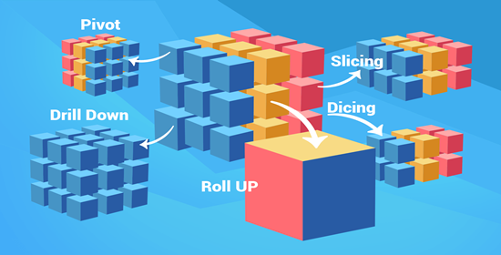

# Sistemas Distribuidos
[Go to Index](resumen.md)

Hay muchos diferentes tipos de sistemas distribuidos.

## RDBMS

Un **RDBMS** es un sistema/servicio que permite crear, actualizar y administrar bases de datos relacionales y la información contenida en las mismas.

Utilizan el **Modelo Relacional**, que significa que la información se guarda como un *conjunto de relaciones* representadas por *tablas*. La tabla tiene *filas* (registros) y *columnas* (atributos), cada fila tiene una *primary key*, y las relaciones se dan por las *foreign key*.

Un *schema* es la implementación física del modelo de datos y permite definir *tipos de datos*, que incluye *constraints* para los mismos, además de posibles optimizaciones de guardado, y también *índices* para optimizar la búsqueda.

También contiene **Transacciones ACID**, que son operaciones que cumplen:
- **Atomicidad** --> Cada transacción es todo o nada
- **Consistencia** --> Toda la información escrita es válida según las restricciones presentes
- **Aislamiento** --> Ninguna transacción es afectada por otra
- **Durabilidad** --> Una vez que se escribió la información, es permanente

Utiliza **SQL** (*Structured Query Language*), un lenguaje de dominio específico para manejar y consultar la información contenida. El SQL está basado en el álgebra relacional, y consiste de 3 sub-lenguajes, *DDL* (Data Definition Language, crear/alterar tablas), DML (Data Manipulation Language, insertar/modificar datos) y DCL (Data Control Language).

### Problemas

Los RDBMS tienen algunos problemas intrínsecos a la tecnología:
- Son demasiado rígidos para nuevos escenarios
- No aplica más la idea "1 tool fits all"
- No es ideal para datos no estructurados
- Dificil de escalar si hay millones de registros
- Las estructuras están optimizadas para lecturas, no tanto para escrituras

## OLAP

Conceptualmente se genera un "cubo" con la información dividida a partir de la granularidad de las operaciones que se quieren hacer.

Tienen diferentes acciones que se pueden hacer, como:
- *Drill Down* --> Agregar
- *Roll Up* --> Desagregar
- *Slice* --> Fijar una dimensión
- *Dice* --> Fijar más de una dimensión
- *Pivot* --> Rotar la selección de dimensiones

Hay que poder llevar los datos desde el RDBMS a la OLAP, para eso se usan operaciones de ETL, **Obtención/Extracción** (E), **Transformación** (T), y **Carga** (L). Estos procesos se hacen en forma batch periódicamente, toman mucho tiempo en procesar y las consultas son bastante rígidas.

## Big Data

Se define a partir de las 3 Vs:
1. **Volumen** --> Cantidad de datos crece de manera geométrica
2. **Variedad** --> Aparecen nuevos tipos de datos, son no/semi estructurados
3. **Velocidad** --> Aumenta la velocidad con la que los datos se generan

### Problemas

La máquina por definición no puede procesar los datos de Big Data, y surgen problemas:
- *Adquisición* --> Hay que soportar tanto el volumen y la velocidad, y habría que usar buffers para evitar problemas de procesamiento.
- *Procesamiento* --> El procesamiento debería ser dentro de un tiempo que resulta útil para la organización, particionando los datos se podría resolver.
- *Guardado* --> Hay que utilizar estrategias de guardado acordes a los datos y necesidades de respuesta.
- *Vista* --> Tener formas de mostrar la información de manera que sea útil para los usuarios del sistema.

## Sistemas Distribuidos

Los sistemas distribuidos conviene escalarlos horizontalmente antes que verticalmente, se busca mantener las transaparencias, es decir, trabajar con un sistema distribuido sin saber que está distribuido.

## Almacenamiento Distribuido

Busca resolver el guardado de información que no entra toda en 1 solo nodo.

### Particionado

Lo más conveniente es dividir la información entre los diferentes nodos. Si la partición es buena algunas *ventajas* son que, permite realizar escrituras más rápidas y eficientes, y acelerar las lecturas. Aunque sigue teniendo ciertas *desventajas*, como la coordinación del cluster y que los datos pueden quedar mal particionados si se utiliza una técnica incorrecta.

### Replicación

Tener 1 copia de cada partición en el sistema es peligroso, si se cae un nodo se puede perder/corromper la información. Deberían haber más de 1 copia de cada partición.

### Consistencia

Al tener particionado y replicación, hay que tomar una decisión en torno a cuando considero al dato escrito y cuando se lo puede leer:
- Al momento de escribir en la partición inicial
- Cuando hay al menos 1 réplica escrita + la partición
- Cuando todas las réplicas están escritas

Hay 2 factores que indican la preferencia en consistencia:
- **Consistencia en Escritura** --> Indica cuántas copias deben indicar que tienen la escritura antes de que se informe como exitosa
- **Consistencia en Lectura** --> Indica cuántas particiones deben responder con el mismo valor para que se devuelva el valor

Hay diferentes modelos de consistencia que nacen:
- **Consistencia Estricto** --> Toda escritura está disponible inmediatamente después de operar
- **Consistencia Eventual** --> Luego de la escritura, puede pasar un tiempo hasta que se reflejan los cambios

### Elasticidad

Capacidad del cluster de modificar la cantidad de nodos sin que el cluster quede offline.

### Tolerancia a Fallos

Si algún nodo se cae, las particiones (principales y backup) se reasignan. Esto requiere coordinación, generalmente de un nodo master o nodo coordinador.