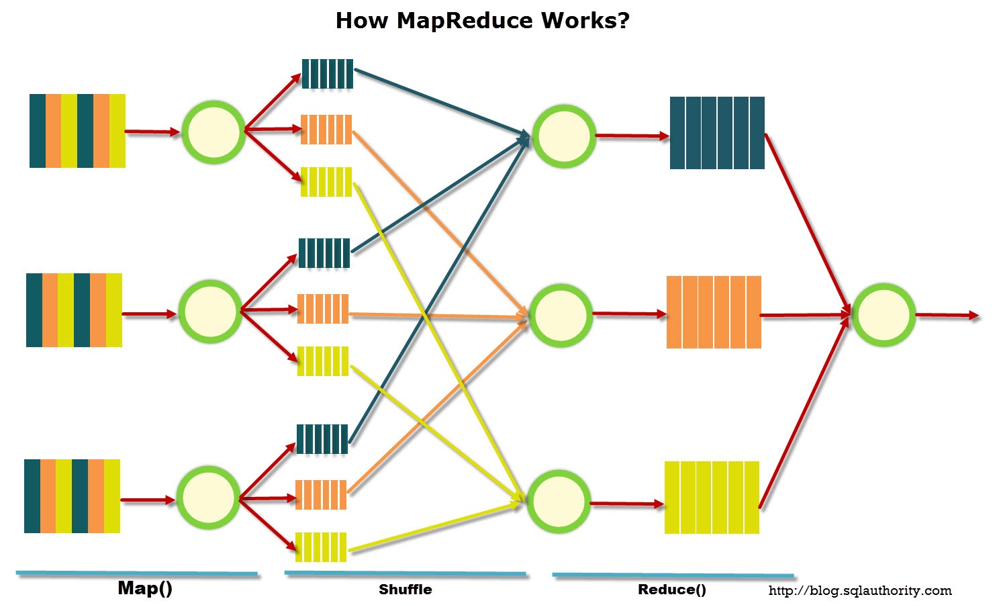

# Procesamiento Distribuido
[Go to Index](resumen.md)

## Hazelcast MapReduce

**MapReduce** es un modelo de programación para el procesamiento de grandes volúmenes de datos de manera paralela y distribuida a partir de primitivas simples. Se subdividen los datos para procesarlos distribuidamente (*divide & conquer*) y se intenta trabajar localmente los datos lo más posible (*data locality*).

Las operaciones se encargan de filtrar y transformar los datos (**map**), para luego agregar esos datos para obtener el valor final (**reduce**).

### Datos

Cada unidad de información que se mueve entre las etapas como entrada y salida cuenta con 2 partes:
- **clave** --> Clasifica o identifica a la información
- **valor** --> Contenido del dato

Cada parte puede ser tan compleja como se quiere, o puede ser simplemente un primitivo.

En cada etapa se aplica una función tal que: `f(k1, v1) = [k2, v2]`

### Etapas

Hay 4 diferentes etapas, *map* y *reduce* se programan, mientras que *sort*/*shuffle* es provisto por el framework.

#### Map

Transforma los datos iniciales en información útil para la operación final.

Map se encarga de:
- **filtrar** --> registros no necesarios
- **proyectar** --> no emite valores que no son necesarios para la operacion final
- **expandir** --> agrega información que puede venir de fuentes externas
- **multiplicar** --> en algunas operaciones necesita emitir más de 1 valor

Recibe un `(key, value)` y emite 0, 1 o más pares `(key, value)`.

#### Sort

Toma los valores emitidos por el mapper y los junta según la clave, para luego enviarlos a cada reducer.

#### Reduce

Se usa un reducer por cada clave emitida, y recibe todos los valores para la clave emitida por el/los mapper/s. Procesa los valores y emite 1 o más valores finales para la clave.

### Etapas Ocultas

Hay etapas ocultas además de las mencionadas antes:
- **preliminar** --> se carga la información y hace disponible para el framework
- **intermedia** --> esto es post-mapper, el **Combiner**, donde se sumarizan los datos dentro del mapper, antes de enviarlos al reducer. Son una forma de optimizar los envios por la red, reduciendolos (OPCIONAL)
- **postprocesado**  --> se puede hacer post-reducción, para darle algún formato a los datos o hacer alguna última transformación (OPCIONAL)
